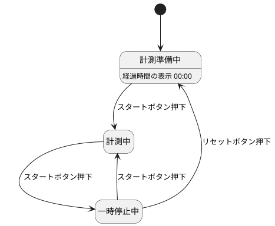

# 3.1

## 状態遷移図

## 状態遷移表

|            | スタートボタン押下 | リセットボタン押下 |
| ---------- | ------------------ | ------------------ |
| 計測準備中 | 計測中             | -                  |
| 計測中     | 一時停止中         | -                  |
| 一時停止中 | 計測中             | 計測準備中         |
