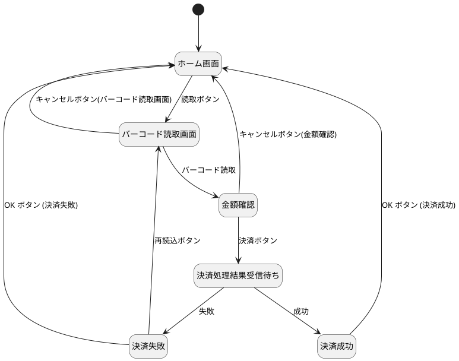

# 3.1

## 1.

### 状態遷移図

### 状態遷移表

|                                      | ホーム画面         | バーコード読取画面 | 金額確認             | 決済処理結果受信待ち | 決済成功   | 決済失敗           |
| ------------------------------------ | ------------------ | ------------------ | -------------------- | -------------------- | ---------- | ------------------ |
| 読取ボタン                           | バーコード読取画面 | N/A                | N/A                  | N/A                  | N/A        | N/A                |
| バーコード読取                       | N/A                | 金額確認           | N/A                  | N/A                  | N/A        | N/A                |
| 決済ボタン                           | N/A                | N/A                | 決済処理結果受信待ち | N/A                  | N/A        | N/A                |
| キャンセルボタン(バーコード読取画面) | N/A                | ホーム画面         | N/A                  | N/A                  | N/A        | N/A                |
| キャンセルボタン(金額確認)           | N/A                | N/A                | ホーム画面           | N/A                  | N/A        | N/A                |
| 成功                                 | N/A                | N/A                | N/A                  | 決済成功             | N/A        | N/A                |
| 失敗                                 | N/A                | N/A                | N/A                  | 決済失敗             | N/A        | N/A                |
| OK ボタン (決済成功)                 | N/A                | N/A                | N/A                  | N/A                  | ホーム画面 | N/A                |
| OK ボタン (決済失敗)                 | N/A                | N/A                | N/A                  | N/A                  | N/A        | ホーム画面         |
| 再読込ボタン                         | N/A                | N/A                | N/A                  | N/A                  | N/A        | バーコード読取画面 |
