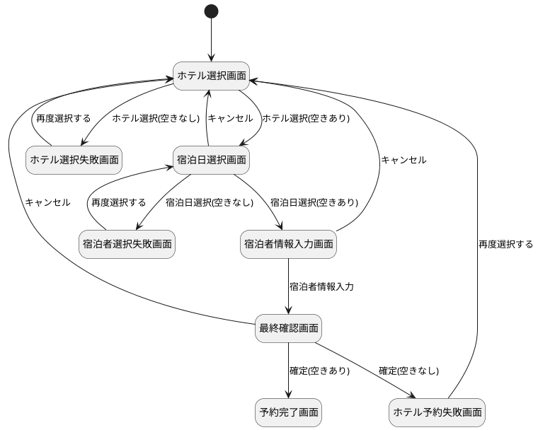

# 3.4

## 1.

### 状態遷移図

```puml
@startuml
hide empty description

[*] --> ホテル選択画面
ホテル選択画面 --> 宿泊日選択画面 : ホテル選択(空きあり)
ホテル選択画面 --> ホテル選択失敗画面 : ホテル選択(空きなし)
ホテル選択失敗画面 --> ホテル選択画面 : 再度選択する
宿泊日選択画面 --> ホテル選択画面 : キャンセル
宿泊日選択画面 --> 宿泊者情報入力画面 : 宿泊日選択(空きあり)
宿泊日選択画面 --> 宿泊者選択失敗画面 : 宿泊日選択(空きなし)
宿泊者選択失敗画面 --> 宿泊日選択画面 : 再度選択する
宿泊者情報入力画面 --> ホテル選択画面 : キャンセル
宿泊者情報入力画面 --> 最終確認画面 : 宿泊者情報入力
最終確認画面 --> ホテル選択画面 : キャンセル
最終確認画面 --> 予約完了画面 : 確定(空きあり)
最終確認画面 --> ホテル予約失敗画面 : 確定(空きなし)
ホテル予約失敗画面 --> ホテル選択画面 : 再度選択する

@enduml
```
