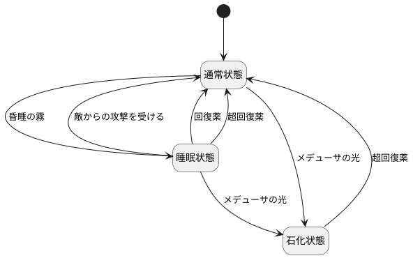

# 3.6

## 1.

## 2.

|                      | 通常状態 | 睡眠状態 | 石化状態 |
| -------------------- | -------- | -------- | -------- |
| 昏睡の霧             | 睡眠状態 | N/A      | N/A      |
| メデューサの光       | 石化状態 | 石化状態 | N/A      |
| 敵からの攻撃を受ける | N/A      | 通常状態 | N/A      |
| 回復薬               | N/A      | 通常状態 | N/A      |
| 超回復薬             | N/A      | 通常状態 | 通常状態 |

## 3.
