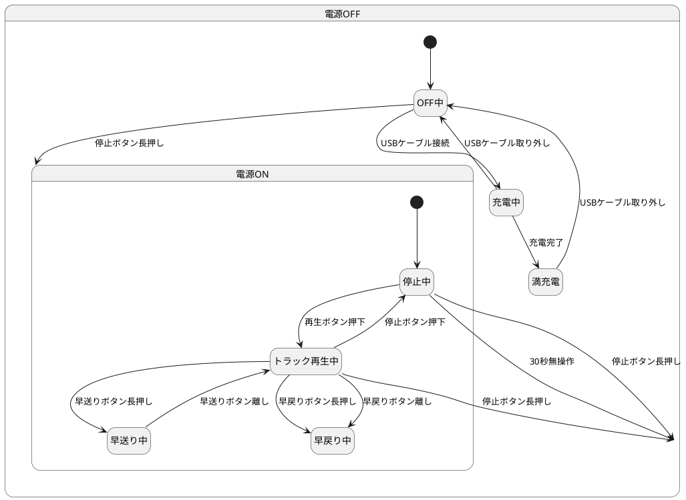

# 5.3

## 1.



## 2.

|                               | 1    | 2    | 3    | 4   | 5   |
| ----------------------------- | ---- | ---- | ---- | --- | --- |
| C1: MP3 Format                | Y    | Y    | Y    | Y   | N   |
| C2: ビットレート 192kbps 以下 | Y    | Y    | Y    | N   | -   |
| C3: ビットレート形式          | 固定 | 可変 | 平均 | -   | -   |
| A1: 再生可能                  | X    |      |      |     |     |
| A2: 再生不可能                |      | X    | X    | X   | X   |

## 3.

- 有効同値パーティション
  - 英字小文字
  - 英字大文字
  - 半角数字
- 無効同値パーティション
  - それ以外

```ts
describe("回答", () => {
  it.each`
    value      | expected
    ${"NUL"}   | ${" "}
    ${"EM"}    | ${" "}
    ${"Space"} | ${" "}
    ${"!"}     | ${" "}
    ${"+"}     | ${" "}
    ${"/"}     | ${" "}
    ${"0"}     | ${"0"}
    ${"5"}     | ${"5"}
    ${"9"}     | ${"9"}
    ${":"}     | ${" "}
    ${">"}     | ${" "}
    ${"@"}     | ${" "}
    ${"A"}     | ${"A"}
    ${"N"}     | ${"A"}
    ${"Z"}     | ${"Z"}
    ${"["}     | ${" "}
    ${"^"}     | ${" "}
    ${"`"}     | ${" "}
    ${"a"}     | ${"a"}
    ${"n"}     | ${"n"}
    ${"z"}     | ${"z"}
    ${"{"}     | ${" "}
    ${"|"}     | ${" "}
    ${"~"}     | ${" "}
    ${"DEL"}   | ${" "}
  `("$value の場合、$expected と表示されること", ({ value, expected }) => {});
});
```

## 4.

| 文字数 | 有効/無効同値クラス           |
| ------ | ----------------------------- |
| 0      | 無効                          |
| 1      | 有効 (表示ありの最小値)       |
| 9      | 有効 (表示ありの代表値)       |
| 18     | 有効 (表示ありの最大値)       |
| 19     | 有効 (スクロール表示の最小値) |
| 25     | 有効 (スクロール表示の代表値) |
| 30     | 有効 (スクロール表示の最大値) |
| 31     | 無効 (表示が省略される最小値) |
| 35     | 無効 (表示が省略される代表値) |

## 5.

空白表示がないケース

| 因子名 | 水準 1     | 水準 2     | 水準 3   | 水準 4 | 水準 5 | 水準 6 |
| ------ | ---------- | ---------- | -------- | ------ | ------ | ------ |
| 文字種 | 英字小文字 | 英字大文字 | 半角数字 |        |        |        |
| 文字数 | 1          | 9          | 18       | 19     | 25     | 30     |
